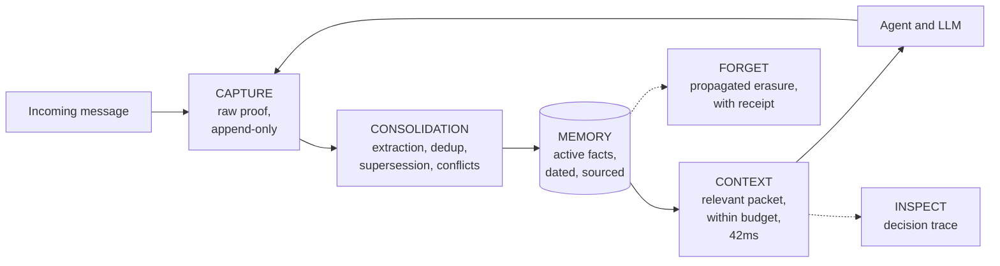

<div align="center">

# Haki

### Reliable long-term memory for AI agents


**Haki gives any AI agent a memory that lasts for months, distinguishes
current facts from stale ones, and can prove every memory it serves.**

[Quickstart](#quickstart) ·
[Coded agent](#1-coded-agent--sdk-and-cli) ·
[Cursor](#2-cursor--mcp-server) ·
[n8n](#3-n8n--template-and-nodes) ·
[Gateway](#4-openai-compatible-gateway) ·
[API](#api-overview)

</div>

---

## What Haki does

An AI agent has no memory beyond a single conversation by default: every new
session starts from zero, and nothing prevents a stale preference from being
applied with full confidence months after it changed.

Haki is a persistent memory layer, independent of the model or framework in
use. It extracts structured facts from an agent's interactions, keeps them
current over time, and returns a relevant, dated, sourced context packet on
every request. It runs under your own infrastructure — `docker compose up`
is enough to start it, and your existing agent, model, and stack stay
unchanged.

## The problem

| Symptom | Consequence |
|---|---|
| Users repeat information already given | Degraded experience, churn |
| The agent applies a preference that was replaced long ago | Incorrect answers, broken trust |
| Full conversation history is reinjected on every call | High cost and latency, diluted context |
| No way to explain why a piece of information was used | No traceability, no debugging |
| One customer's data can leak into another's context | Security incident |

Generic vector databases and conversation summaries work in a demo and
degrade after a few weeks of real usage: stale facts served as current,
undetected contradictions, no explainability.

## The approach

**A fact ledger, not a conversation log.** Haki does not archive raw
messages for later retrieval — it extracts structured facts (preferences,
constraints, decisions), each linked to the source event that justifies it.

**Bitemporality and supersession.** Every fact carries a validity window and
an explicit status. When information changes, the previous fact is marked
*superseded* — never silently deleted, never served again as current. An
unresolved contradiction hides both versions and flags it instead of
guessing.

**Systematic traceability.** Every context packet ships with its sources,
validity dates, and a trace explaining which memories were included,
excluded, or blocked, and why.

---

## Quickstart

> Requirements: Docker and [uv](https://docs.astral.sh/uv/). Defaults in
> `.env.example` are enough to start — no key required. Copy it to `.env`
> for a real LLM key.

```bash
# Infrastructure (PostgreSQL 16 + pgvector, Redis 7)
docker compose up -d

# Dependencies (uv installs Python 3.12 if needed)
uv sync

# Database
uv run alembic upgrade head

# API
uv run uvicorn app.main:app --port 8100
```

In a second terminal:

```bash
uv run haki connect --api-url http://localhost:8100
uv run haki verify
```

`haki verify` runs a full end-to-end scenario in a few seconds: it stores a
preference, opens a new conversation, and confirms the agent recalls it —
with per-step latency and the associated trace.

```
haki verify — subject usr_verify_8a4a67338864
  [  0.05 s] capture (thread thr_a1e14345)
  [  3.25 s] consolidate: 1 job(s) processed
  [  0.04 s] context (new thread thr_ef814359)
  recalled: invoice_language = {"language": "fr"}
  trace_id: 0587fc4f-74a1-46af-a592-5789d1269072
OK — total 3.35 s
```

Embeddings are computed locally and are multilingual by default (French,
English, Spanish, and roughly 50 other languages) — a memory captured in one
language is retrieved by a query in another.

---

## Four ways to use Haki

### 1. Coded agent — SDK and CLI

*Python or TypeScript developers. A few lines around an existing LLM call.*

```python
from haki import HakiClient
from haki.runtime import build_prompt_context, capture_turn

client = HakiClient("http://localhost:8100")

packet = client.context(subject_id="usr_42", query=user_msg, project_id="prj")
prompt = build_prompt_context(packet) + "\n" + system_prompt

answer = my_llm(prompt, user_msg)

capture_turn(client, "usr_42", "prj", user_msg, answer)
```

<details>
<summary><b>SDK details</b> (methods, async, errors)</summary>

- `capture(events, idempotency_key)` — idempotent ingestion: a network retry
  never creates a duplicate;
- `context(subject_id, query, project_id, budget_tokens=900)` — the
  ContextPacket, with `trace_id`;
- `inspect(trace_id)` — why these memories were chosen;
- `timeline(subject_id, project_id)`, `consolidate()`, `forget(...)`,
  `health()`;
- Async variant: `AsyncHakiClient`;
- Typed errors: `HakiApiError` (`error_type`, `field`, `status_code`),
  `HakiConnectionError`.

CLI: `haki connect`, `haki login` (device-code auth against a Haki Cloud
instance), `haki verify`, `haki status`, `haki mcp` (Cursor packaging).
</details>

#### TypeScript SDK (parity with the Python SDK)

```bash
cd sdk/typescript && npm install && npm run build && npm test
```

```typescript
import { HakiClient, buildPromptContext, captureTurn } from "haki";

const client = new HakiClient({ baseUrl: "http://localhost:8100", apiKey: "hk_..." });
const { packet } = await client.context({ subjectId: "usr_42", query: userMsg, projectId: "prj" });
const prompt = buildPromptContext(packet) + "\n" + systemPrompt;
const answer = await myLlm(prompt, userMsg);
await captureTurn(client, { subjectId: "usr_42", projectId: "prj", userMsg, assistantMsg: answer });
```

CLI `haki-ts` shares the same `~/.haki/config.json` as the Python CLI — the
two are interchangeable. Runnable example:
[`sdk/typescript/examples/basic-agent.mjs`](sdk/typescript/examples/basic-agent.mjs).

### 2. Cursor — MCP server

```bash
uv run haki mcp   # prints the deeplink, mcp.json and Project Rule
```

Four tools appear in Cursor:

| Tool | Role |
|---|---|
| `haki_context` | Recall relevant project context before coding |
| `haki_capture` | Store a decision, convention, or resolved issue |
| `haki_inspect` | See why a memory was used |
| `haki_forget` | Forget a piece of information |

> Known limitation: MCP cannot intercept every Cursor conversation — the
> server only sees tool calls Cursor decides to make. Real coverage is
> measured, never presented as total.

### 3. n8n — template and nodes

Chain: `Webhook → Haki Context → AI Agent → Haki Capture → Respond`

Two options in [`integrations/n8n/`](integrations/n8n/README.md): a native
template (`haki-persistent-support-agent.json`, standard HTTP nodes, no
install required) and a visual node package (`n8n-nodes-haki`).

### 4. OpenAI-compatible gateway

```python
import openai

client = openai.OpenAI(
    base_url="http://localhost:8100/gateway/v1",
    api_key="hk_...",
    default_headers={"X-Haki-Subject-Id": "usr_42"},
)
client.chat.completions.create(model="...", messages=[...])
```

Memory is injected before the call and captured after, with three response
headers: `X-Haki-Memory`, `X-Haki-Trace-Id`, `X-Haki-Context-Ms`. Identity is
passed via headers only, never inferred from the request body. Streaming is
a pure pass-through (documented tradeoff, see
[`docs/SECURITY.md`](docs/SECURITY.md) and the architecture notes below).

---

## How it works



1. **CAPTURE** — the application sends an event; Haki stores it as immutable
   proof and acknowledges in milliseconds. Idempotent: a network retry never
   creates a duplicate.
2. **CONSOLIDATION** — in the background, Haki decides what becomes a
   durable fact, deduplicates, and detects changes (supersession) and
   contradictions (conflict, hidden until resolved).
3. **CONTEXT** — before each response, the agent requests relevant memory:
   active, valid, in-scope facts only, ranked by relevance, within a strict
   token budget — around 42ms.
4. **INSPECT** — at any time, the trace explains why a memory was included,
   excluded, or blocked.
5. **FORGET** — a correction or erasure propagates to everything derived
   from it, with a timestamped receipt.

---

## Measured performance

Reproducible benchmark: `uv run python scripts/benchmark_context.py`.

| Facts in memory | p50 | p95 | PRD target |
|---|---:|---:|---|
| 100 | 60.5 ms | 80.6 ms | < 250 ms |
| 1,000 | 63.7 ms | 68.0 ms | < 250 ms |
| 10,000 | 27.8 ms | 42.5 ms | < 250 ms |

Embeddings run locally (ONNX on CPU, 384-dimension multilingual model) — no
network call in the critical path. LLM extraction cost is fully
asynchronous and never slows down a response.

## Public benchmarks

Haki publishes a reproducible benchmark harness: pinned dataset and
checksum, models, prompts, budgets and prices, a full-context baseline
re-run under the identical protocol, and metrics rarely published in this
space — contradiction leakage, abstention rate, tokens per packet, latency,
cost. See [`eval/`](eval/) and [`eval/results/`](eval/results/).

---

## API overview

| Endpoint | Role |
|---|---|
| `POST /v1/capture` | Send events (idempotent, immediate ack) |
| `POST /v1/context` | Get the ContextPacket (facts, warnings, `trace_id`) |
| `GET /v1/inspect/{trace_id}` | Full trace of a memory decision |
| `GET /v1/timeline` | Raw events for a subject |
| `GET /v1/facts` | A subject's facts, all statuses |
| `GET /v1/traces` | Recent traces for a project |
| `GET /v1/conflicts` | Contradictions pending resolution |
| `POST /v1/conflicts/{id}/resolve` | Resolve a conflict |
| `POST /v1/feedback` | Rate a memory (`useful`/`irrelevant`/`incorrect`) |
| `POST/GET/DELETE /v1/keys` | Manage API keys |
| `POST /v1/consolidate` | Trigger consolidation |
| `POST /v1/forget` | Forget a fact or subject, with a receipt |
| `POST /gateway/v1/chat/completions` | OpenAI-compatible proxy with automatic memory |
| `GET /health` | API health |
| `/mcp` | MCP server |

Errors are typed and actionable:
`{"error": {"type": "missing_scope", "message": "...", "field": "..."}}`.

---

## Security, scope, and forgetting

- **Per-project API keys**: every `/v1/*` call requires
  `Authorization: Bearer hk_...`. A key is bound to a single project;
  requesting another project returns `403 forbidden_scope` without
  revealing its existence.
- **PostgreSQL Row-Level Security**: isolation is enforced by the database
  itself, not just application code — proven by a non-disclosure test.
- **Deterministic Policy Engine**: every read and write passes through
  explicit rules, never through the LLM.
- **The model never chooses scope**: `project_id` and `subject_id` come from
  the caller's backend or configuration, never from the LLM.
- **Real forgetting**: `POST /v1/forget` propagates erasure to facts,
  embeddings, events, and traces, with a timestamped receipt.

Full details: [`docs/SECURITY.md`](docs/SECURITY.md).

---

## Architecture

<details>
<summary><b>Stack and modules</b></summary>

**Stack**: FastAPI · SQLAlchemy 2.0 async · PostgreSQL 16 + pgvector (hnsw)
· Alembic · Redis 7 · fastembed (ONNX CPU) · official MCP SDK.

**Modules**:

- **Memory Ledger** (`app/ledger/`) — append-only bitemporal events, versioned
  facts, explicit status transitions:
  `candidate → active → superseded/disputed/disabled → deleted`.
- **Memory Consolidator** (`app/consolidator/`) — LLM extraction validated
  by Pydantic, content-based deduplication, supersession, conflict sets. A
  write gate rejects echoes, unsourced inferences, and imperative
  directives disguised as facts, with an explicit reason taxonomy.
- **Context Assembler** (`app/context/`) — hard filters (active, scope,
  validity) then a hybrid score:
  `0.6 × cosine similarity + 0.25 × full-text + 0.15 × recency`.
- **Interchangeable providers** (`app/providers/`) — extractor and embedder
  configured independently, no vendor SDK hardcoded.
- **MCP server** (`app/mcp_server/`) — mounted in the API, Streamable HTTP
  transport.
- **Gateway** (`app/gateway/`) — OpenAI-compatible proxy: memory injection,
  upstream forwarding without ever sending the Haki key upstream, idempotent
  post-response capture.
</details>

---

## Tests

Real PostgreSQL, no database mocks: `uv run pytest` and
`cd sdk/typescript && npm test`.

Tests verify behavioral guarantees, not implementation details: a
superseded fact is never returned as active, a subject never sees another
subject's memory, a network retry never creates a duplicate, an open
conflict hides both facts, nothing is served after a forget, illegal status
transitions are rejected.

---

## Repository structure

```
haki/
├── app/                    # FastAPI API (ledger, consolidator, context, gateway, MCP)
├── sdk/python/              # Python SDK + haki CLI
├── sdk/typescript/          # TypeScript SDK + haki-ts CLI (parity)
├── integrations/n8n/        # Community template + nodes
├── alembic/                 # PostgreSQL migrations
├── tests/                   # Behavioral test suite
├── eval/                    # Public benchmark harness (LoCoMo + LongMemEval)
├── scripts/                 # Benchmarks and diagnostics
├── docs-site/                # Documentation source (Mintlify)
└── docker-compose.yml        # Postgres + pgvector + Redis
```

## Cloud

A hosted version with a web console, managed infrastructure, and
subscription billing is available separately — this repository contains the
self-hostable core. See [gethaki.space](https://gethaki.space).

## License

Apache License 2.0 — see [`LICENSE`](LICENSE).

---

<div align="center">

**Haki — your agent remembers what matters, and can prove it.**

</div>
