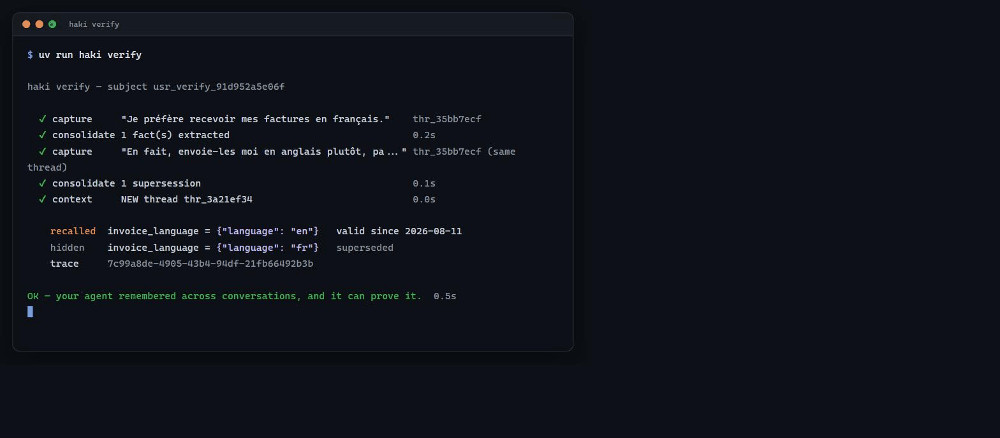
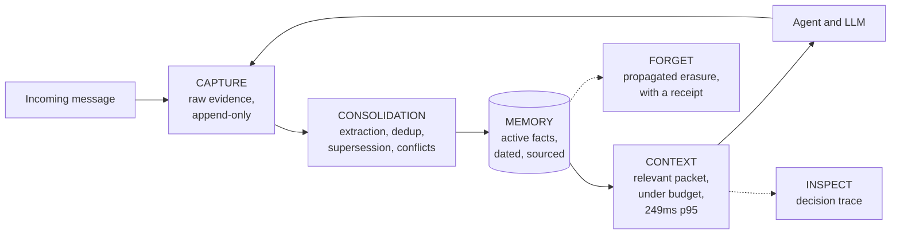

<div align="center">

# Haki

### Reliable memory for AI agents
*Context with proof: every fact carries a date, a source, and a status.*


**Haki gives any AI agent a memory that lasts for months —**
**that tells current from stale — and that can prove every recollection.**

[Quickstart](#quickstart) ·
[Coded agent](#1-coded-agent--sdk-and-cli) ·
[Cursor](#2-cursor--mcp-server) ·
[n8n](#3-n8n--template-and-nodes) ·
[Gateway](#4-openai-compatible-gateway) ·
[API](#api-at-a-glance) ·
[gethaki.space](https://gethaki.space)

</div>

---

## What Haki does

Today, an AI agent remembers nothing beyond a single conversation: every new
session starts from scratch, re-explains context, and can apply a preference
that went stale months ago with no way to tell.

Haki is a persistent memory layer, independent of whatever model or framework
you use: it extracts structured facts from an agent's exchanges, keeps them
current over time, and hands every new request a relevant, dated, sourced
context packet. It stays entirely under your control — one `docker compose
up` installs it, and your existing agent, model, and infrastructure don't
change.

---

## The problem

Teams building AI agents in production run into the same limits, every time:

| Symptom | Consequence |
|---|---|
| The user has to repeat information already given | Degraded experience, churn |
| The agent applies a preference that was overridden long ago | Wrong answer, broken trust |
| The entire history gets replayed into the prompt on every call | High cost and latency, useful context diluted |
| No way to explain why a piece of information was used | No traceability, no debugging |
| One customer's data can leak into another's context | Security incident |

Existing approaches (generic vector stores, conversation summaries) work in a
demo but degrade after a few weeks of real usage: stale information served as
current, undetected contradictions, zero explainability.

---

## The approach

**A fact ledger, not a conversation history.** Haki doesn't archive raw
messages to replay later: it extracts structured facts from them —
preferences, constraints, decisions — each one linked back to the source
event that grounds it.

**Bitemporality and supersession.** Every fact carries an explicit validity
date and status. When information changes, the old fact is marked
*superseded* — never silently deleted, never served again as current. On an
unresolved contradiction, both versions are held back and flagged rather than
served at random.

**Systematic traceability.** Every context packet injected comes with its
sources, its validity dates, and a trace explaining which memories were kept,
excluded, or blocked, and why. "Why did the agent use this piece of
information?" has a verifiable answer in under a minute.

---

## Quickstart

> Prerequisites: Docker and [uv](https://docs.astral.sh/uv/). The defaults in
> `.env.example` are enough to get started — no key required. For custom
> configuration (a real LLM key, etc.), copy that file to `.env`.

```bash
# Infrastructure (PostgreSQL 16 + pgvector, Redis 7)
docker compose up -d

# Dependencies (uv installs Python 3.12 if needed)
uv sync

# Database
uv run alembic upgrade head

# API
uv run uvicorn app.main:app --port 8100
```

> If anything goes wrong, `bash scripts/doctor.sh` diagnoses Docker, the
> containers, Postgres, `.env`, migrations, and the API in one command — read
> only, no side effects, safe to re-run as often as needed.

In a second terminal, verify everything works:

```bash
uv run haki connect --api-url http://localhost:8100
uv run haki verify
```

`haki verify` runs a complete scenario in a few seconds: a preference, then a
change of mind in the **same** conversation, then a **new** conversation that
queries memory. It must serve the current value, keep the old one at status
`superseded` instead of erasing it, and tie the whole thing to a trace.



```
haki verify — subject usr_verify_91d952a5e06f

  ✔ capture     "Je préfère recevoir mes factures en français."    thr_35bb7ecf
  ✔ consolidate 1 fact(s) extracted                                0.2s
  ✔ capture     "En fait, envoie-les moi en anglais plutôt, pa..." thr_35bb7ecf (same thread)
  ✔ consolidate 1 supersession                                     0.1s
  ✔ context     NEW thread thr_3a21ef34                            0.0s

    recalled  invoice_language = {"language": "en"}   valid since 2026-08-11
    hidden    invoice_language = {"language": "fr"}   superseded
    trace     7c99a8de-4905-43b4-94df-21fb66492b3b

OK — your agent remembered across conversations, and it can prove it.  0.5s
```

The command exits 1 if the stale value is still served, **or** if the old
value isn't found marked as superseded: serving the right value by accident,
with no link between the two facts, isn't a memory that actually updates.

> Multilingual by default: local embeddings are multilingual (French,
> English, Spanish, and about fifty other languages) — the demo scenario
> above is captured in French on purpose, and a query in a different
> language still finds it. Verified end-to-end
> (`scripts/check_multilingual.py`).

---

## Four ways to use Haki

### 1. Coded agent — SDK and CLI

*Python or TypeScript developers. A few lines around your existing LLM call.*

```python
from haki import HakiClient
from haki.runtime import build_prompt_context, capture_turn

client = HakiClient("http://localhost:8100")

# Before the LLM call: memory becomes an instruction block
packet = client.context(subject_id="usr_42", query=user_msg, project_id="prj")
prompt = build_prompt_context(packet) + "\n" + system_prompt

answer = my_llm(prompt, user_msg)   # your LLM and app code don't change

# After the LLM call: the conversation turn goes back into memory
capture_turn(client, "usr_42", "prj", user_msg, answer)
```

<details>
<summary><b>SDK details</b> (methods, async, errors)</summary>

- `capture(events, idempotency_key)` — idempotent ingestion: a network retry
  never creates a duplicate;
- `context(subject_id, query, project_id, budget_tokens=2000)` — the
  ContextPacket, with `trace_id`;
- `inspect(trace_id)` — why these memories were chosen;
- `timeline(subject_id, project_id)`, `consolidate_subject(...)`,
  `facts(...)`, `consolidate()`, `forget(...)`, `health()`;
- Async variant: `AsyncHakiClient`;
- Typed errors: `HakiApiError` (`error_type`, `field`, `status_code`),
  `HakiConnectionError`.

CLI: `haki login` (device-code sign-in, see below), `haki connect`
(configure and test with a key in hand), `haki verify` (timed memory test),
`haki status` (API health), `haki mcp` (Cursor packaging).

**`haki login`** — for a Cloud account, the `hk_` key is only ever shown
once, at provisioning: the terminal has no way to retrieve it again. The
device-code flow (RFC 8628) closes that gap without a new secret. The CLI
shows an `XXXX-XXXX` code and opens
`<HAKI_CONSOLE_BASE_URL>/cli-auth` with the code already filled in
(`verification_uri_complete`); the code stays on screen too, so it can be
typed by hand from a phone. You approve it in the console, already signed
in — **the terminal then receives a fresh, dedicated key**, not the
console's own — revoking that terminal from *Keys* disconnects nothing else.
The key is served exactly once, by the poll that consumes it.

Server-side, `HAKI_CONSOLE_SERVICE_KEY` must be configured (it's what
authenticates the console against `/v1/cli/device/approve`). Wrong codes are
rate-limited **per person**, not per IP: every approval arrives from the same
address (the console's own backend), so a per-IP counter would be a shared
bucket any single user could exhaust for everyone else.
</details>

#### TypeScript SDK (parity with the Python SDK)

*Same methods, same typed errors, same `<haki_memory>` block — zero runtime
dependency (native fetch, Node 18+).*

```bash
cd sdk/typescript && npm install && npm run build && npm test
```

```typescript
import { HakiClient, buildPromptContext, captureTurn } from "gethaki";

const client = new HakiClient({ baseUrl: "http://localhost:8100", apiKey: "hk_..." });

const { packet } = await client.context({ subjectId: "usr_42", query: userMsg, projectId: "prj" });
const prompt = buildPromptContext(packet) + "\n" + systemPrompt;
const answer = await myLlm(prompt, userMsg);
await captureTurn(client, { subjectId: "usr_42", projectId: "prj", userMsg, assistantMsg: answer });
```

CLI `haki-ts` (`node dist/cli.js …`): `connect`, `verify`, `status` — same
`~/.haki/config.json` file as the Python CLI, the two are interchangeable.
Runnable example:
[`sdk/typescript/examples/basic-agent.mjs`](sdk/typescript/examples/basic-agent.mjs).

### 2. Cursor — MCP server

*Cursor users. One-click install, no key to copy by hand.*

```bash
uv run haki mcp   # prints the deeplink, the mcp.json, and the Project Rule
```

1. The "Add Haki to Cursor" deeplink installs the MCP server;
2. The Project Rule (`.cursor/rules/haki.mdc`) tells the agent when to
   remember and when to recall;
3. Cursor then keeps decisions, conventions, and resolved bugs across
   sessions.

Four tools show up in Cursor:

| Tool | Role |
|---|---|
| `haki_context` | Recall the project's relevant context before coding |
| `haki_capture` | Store a decision, a convention, a resolved bug |
| `haki_inspect` | See why a memory was used |
| `haki_forget` | Forget a piece of information |

> Known, documented limit: MCP can't intercept every Cursor conversation —
> the server only sees the tool calls Cursor decides to trigger. The Project
> Rule tells the agent *when* to call them; real coverage is measured, never
> presented as total.

### 3. n8n — template and nodes

*No-code builders. One template to import, three things to configure.*

Chain: `Webhook → Haki Context → AI Agent → Haki Capture → Respond`

Two options in [`integrations/n8n/`](integrations/n8n/README.md):

- Native template `haki-persistent-support-agent.json` — importable into any
  n8n instance, no extra install (standard HTTP nodes);
- Node package `n8n-nodes-haki` — visual `Haki Context` and `Haki Capture`
  nodes, with built-in validation.

Three settings are all it takes: the Haki credential, the LLM credential, and
the counterpart's identity (`subject`). A call with no identity is refused —
a memory with no stable identity isn't reliable.

> Verified against a real n8n instance (Docker): a preference stated in the
> first message is recalled in the second, with its source.

### 4. OpenAI-compatible gateway

*Apps already speaking the OpenAI API. Only `base_url` changes — memory
becomes automatic.*

```python
import openai

client = openai.OpenAI(
    base_url="http://localhost:8100/gateway/v1",
    api_key="hk_...",                                 # Haki key
    default_headers={"X-Haki-Subject-Id": "usr_42"},  # who to remember
)
client.chat.completions.create(model="...", messages=[...])
```

On every `POST /gateway/v1/chat/completions` call: the subject's memory is
injected at the top of the system message (a `<haki_memory>…</haki_memory>`
block), the call is forwarded to the configured provider (`HAKI_LLM_*` — the
Haki key itself is never sent upstream), the exchange is then captured
(`conversation.turn`, idempotent), and consolidation resumes in the
background. The response returned is the provider's own, unchanged, plus
three headers: `X-Haki-Memory`, `X-Haki-Trace-Id`, `X-Haki-Context-Ms`.

- Identity travels via headers, never the request body (the model never
  chooses what gets remembered): `X-Haki-Subject-Id` (required for memory),
  `X-Haki-Thread-Id`, `X-Haki-Run-Id`, `X-Haki-Purpose`,
  `X-Haki-Idempotency-Key` (default: a hash of the body — a retry never
  creates a duplicate).
- Controlled degradation: with no identity, the request passes through
  unmodified (`X-Haki-Memory: disabled`); if context can't be built, the
  request still goes out, flagged `degraded`. The agent is never blocked by
  Haki.
- Streaming: `stream: true` passes straight through
  (`X-Haki-Memory: disabled`, no injection, no capture) — a deliberate
  choice: injecting without being able to capture the final response would
  break the memory loop, and buffering the whole stream would defeat the
  point of streaming in the first place.
- Documented limit (see `research/Haki_Memory_Runtime.md` in the private
  repo): the gateway observes calls to the model, not tools the agent runs
  locally between two calls — those are captured via the SDK or the API
  directly.

An httpx variant lives in the SDK too: `haki.gateway.gateway_client(base_url,
api_key, subject_id, ...)` (and `async_gateway_client`). Memory overhead is
dominated by `build_context` (about 15 ms locally, `/v1/context` p95 under
250 ms) — reproducible benchmark:
`uv run python scripts/benchmark_gateway.py --api-key hk_...`.

---

## Hosted Cloud

*Prefer not to run your own infrastructure?* [gethaki.space](https://gethaki.space)
hosts the same API, plus a web console for browsing memory, inspecting
traces, and resolving conflicts by hand. Self-hosting stays fully supported
and free — the API in this repository is the same one Cloud runs.

---

## How it works



1. **CAPTURE** — Your application sends an event (a message, an action, a
   tool result). Haki records it as immutable evidence and replies in a few
   milliseconds. A network retry never creates a duplicate (idempotence).
2. **CONSOLIDATION** — In the background, Haki reads events and decides what
   should become a durable fact. It deduplicates, detects changes (the old
   fact becomes *superseded*) and contradictions (status *conflict*, held
   back until resolved). A fact is identified by
   **(subject, predicate, qualifiers)**: "weekday wake-up time" and "weekend
   wake-up time" are two distinct, coexisting facts, not a contradiction —
   and a different qualifier is never conflated with another one, no matter
   how close the wording.
3. **CONTEXT** — Before every response, the agent asks for relevant memory.
   Haki only returns active, valid, in-scope facts, ranked by relevance,
   within a strict token budget — p95 measured at 249 ms across 10,000 facts
   (see `scripts/benchmark_context.py`).
4. **INSPECT** — At any time, the trace explains why a piece of information
   was kept, excluded, or blocked.
5. **FORGET** — A correction or an erasure propagates to everything derived
   from it, with a timestamped receipt.

---

## Concepts

| Concept | Definition |
|---|---|
| **Subject** (`subject`) | The person or entity being remembered. A stable identity is required — no memory without one. |
| **Event** | The raw evidence: "this message was exchanged on this date." Immutable. |
| **Fact** | A piece of information considered true at a given point in time. Dated, versioned, sourced. |
| **Supersession** | One fact replaces another. The old one stays in history but is never served again as current. |
| **Conflict** | Two facts contradict each other with no automatic arbitration possible: both are held back and flagged. |
| **ContextPacket** | The memory packet injected before a response: the relevant facts, within budget, with their sources. |
| **Trace** | The log explaining every memory decision: kept, excluded, blocked, and why. |
| **Scope** | The sealed boundary of a memory (organization → project → subject). Nothing crosses it. |

---

## Positioning

| | Common approaches | Haki |
|---|---|---|
| Change of mind | Old and new fact coexist, a source of contradictions | The old fact is superseded; only the current one is served |
| Contradiction | Served to the model at random | Held back, flagged, explicitly resolvable |
| Explainability | Black box | Trace and sources for every fact |
| Forgetting | Deleting a row | Cascading propagation, with a receipt |
| Retrieval latency | A network embedding call on every request | Local embeddings: no network call in the critical path |
| Language coverage | Often optimized for English only | Multilingual natively (about 50 languages) |
| Deployment | Several services to assemble (vector store, queue, etc.) | A single `docker compose up` |

---

## Measured performance

Reproducible benchmark: `uv run python scripts/benchmark_context.py` (100
requests per size, local embeddings, Windows development machine).

| Facts in memory | p50 | p95 | PRD target |
|---|---:|---:|---|
| 100 | 60.5 ms | 80.6 ms | < 250 ms |
| 1,000 | 63.7 ms | 68.0 ms | < 250 ms |
| 10,000 | 27.8 ms | 42.5 ms | < 250 ms |

Embeddings are computed locally (ONNX on CPU, multilingual 384-dimension
model) — no network call in the critical path. Retrieval combines a vector
index (hnsw) with a full-text index (GIN), then scores only the best
candidates. LLM cost (extraction) is fully asynchronous and never slows down
a response.

---

## Public benchmarks

Haki publishes a reproducible benchmark harness, not a cherry-picked
number: a frozen, versioned configuration (dataset and checksum, models,
prompts, budgets, prices), a full-context baseline re-run under the exact
same protocol (same model, same prompt, same judge), and metrics the
field rarely publishes — contradiction leakage, abstention rate, tokens
per packet, latency, cost.

- Harness: [`eval/`](eval/) (LoCoMo and LongMemEval_S loaders, pipeline,
  judge, reports).
- Results are never committed to this repository on purpose — run the
  harness yourself against the pinned dataset and frozen config, and the
  numbers you get (written to `eval/results/`, gitignored) are yours to
  trust or challenge, not a number we chose to show you.
- Reproduction: exact commands in [`eval/README.md`](eval/README.md).

---

## API at a glance

| Endpoint | Role |
|---|---|
| `POST /v1/capture` | Send events (idempotent, immediate acknowledgement) |
| `POST /v1/context` | Get the ContextPacket (facts, warnings, `trace_id`) |
| `GET /v1/inspect/{trace_id}` | The full trace of a memory decision |
| `GET /v1/timeline` | A subject's events (raw evidence) |
| `GET /v1/facts` | A subject's facts, every status (sources, dates, versions) |
| `GET /v1/traces` | A project's recent traces (last 50) |
| `GET /v1/conflicts` | Contradictions awaiting resolution |
| `POST /v1/conflicts/{id}/resolve` | Resolve a conflict |
| `POST /v1/feedback` | Rate a memory (`useful`/`irrelevant`/`incorrect`) |
| `POST /v1/keys` · `GET` · `DELETE` | Manage API keys |
| `POST /v1/consolidate` | Trigger consolidation (dev/ops) |
| `POST /v1/forget` | Forget a fact or a subject, with a receipt |
| `POST /gateway/v1/chat/completions` | OpenAI-compatible proxy: automatic memory injection and capture |
| `GET /v1/stats/health` | Memory health metrics (freshness, open conflicts, coverage) |
| `GET /health` | API health |
| `/mcp` | MCP server (Cursor and other MCP clients) |

> The curl examples below assume an existing key: create one with
> `curl -X POST http://localhost:8100/v1/keys -d '{"org_id":"org_acme","project_id":"prj_support","label":"dev"}'`
> (the first key is free, after that every key manages its own project), then
> add `-H "Authorization: Bearer hk_..."` to every call.

Errors are typed and actionable:
`{"error": {"type": "missing_scope", "message": "...", "field": "..."}}`
— never a generic message.

<details>
<summary><b>Full example: capture then context</b></summary>

```bash
# Capture a preference
curl -X POST http://localhost:8100/v1/capture \
  -H "Content-Type: application/json" \
  -d '{
    "idempotency_key": "demo-1",
    "events": [{
      "org_id": "org_acme", "project_id": "prj_support",
      "subject_type": "user", "subject_id": "usr_42",
      "kind": "conversation.message",
      "occurred_at": "2026-07-15T10:00:00Z",
      "payload": {"role": "user", "content": "I prefer my invoices in French."},
      "classification": ["customer-data"]
    }]
  }'

# Consolidate (extracts the durable fact)
curl -X POST http://localhost:8100/v1/consolidate

# Ask for memory before a response
curl -X POST http://localhost:8100/v1/context \
  -H "Content-Type: application/json" \
  -d '{
    "project_id": "prj_support", "subject_id": "usr_42",
    "query": "what language should the invoice be in?",
    "budget_tokens": 2000
  }'
```

Response: the fact `invoice_language: {"language": "fr"}`, its validity
date, the source event id, and a `trace_id`.
</details>

---

## Security, scopes, and forgetting

- **Per-project API keys**: every `/v1/*` call requires
  `Authorization: Bearer hk_...` by default. A key is bound to a single
  project: asking for another one returns `403 forbidden_scope`, without ever
  revealing that other projects exist. Managed via
  `POST/GET/DELETE /v1/keys` (details in
  [`docs/SECURITY.md`](docs/SECURITY.md)).
- **PostgreSQL Row-Level Security**: isolation is guaranteed by the database
  itself (RLS on events, facts, traces, conflicts) — even if an application
  filter is forgotten, a query can't cross projects (proven by a
  non-disclosure test).
- **Deterministic policy engine**: every read and write goes through explicit
  rules (scope present, key/project match, audit) — never through the
  language model.
- **The model never chooses scopes**: `project_id` and `subject_id` come from
  the calling backend or its configuration, never from the LLM.
- **Feedback and correction**: `POST /v1/feedback`
  (`useful`/`irrelevant`/`incorrect` — a fact flagged incorrect becomes
  `disputed` and is never served again); `POST /v1/conflicts/{id}/resolve`
  settles a contradiction with full history.
- **Secrets**: the LLM key lives in `.env` (git-ignored, template provided in
  [`.env.example`](.env.example)), never in code, the terminal, or the
  frontend.
- **Real forgetting**: `POST /v1/forget` propagates erasure to facts,
  embeddings, events, and traces, with a timestamped receipt in
  `forget_receipts`.
- An open dev mode exists (`HAKI_AUTH_REQUIRED=false`) for local use only,
  with an explicit warning at startup.

---

## Architecture

<details>
<summary><b>Stack and modules (for the technically curious)</b></summary>

**Stack**: FastAPI · SQLAlchemy 2.0 async · PostgreSQL 16 + pgvector (hnsw) ·
Alembic · Redis 7 · fastembed (ONNX CPU) · official MCP SDK.

**Modules**:

- **Memory Ledger** (`app/ledger/`) — bitemporal, append-only events
  (`occurred_at` = business time, `recorded_at` = system time), versioned
  facts, explicit status transitions:
  `candidate → active → superseded/disputed/disabled → deleted` (terminal).
- **Memory Consolidator** (`app/consolidator/`) — LLM extraction validated
  by Pydantic (no batch can ever crash), content-based deduplication
  (idempotent replay), supersession, conflict sets. A provider failure marks
  the job `failed` without touching events, which stay replayable.
- **Context Assembler** (`app/context/`) — strict filters (active, scope,
  validity) then a hybrid score:
  `0.6 × cosine similarity + 0.25 × full-text + 0.15 × recency`, plus
  cross-encoder reranking, multi-hop entity expansion, and a temporal
  grounding pass (see `research/Haki_Livre_Construction_2026-08-15.md` in the
  private repo for how these interact). Two-phase retrieval (index selection,
  then scoring) for a cost that stays stable regardless of memory size.
- **Interchangeable providers** (`app/providers/`) — extractor
  (`HAKI_LLM_PROVIDER=fake|openai`) and embedder
  (`HAKI_EMBED_PROVIDER=local|fake`, local by default) configured
  independently. No vendor SDK hardcoded in.
- **MCP server** (`app/mcp_server/`) — mounted inside the API, Streamable
  HTTP transport.
- **Gateway** (`app/gateway/`) — OpenAI-compatible proxy: injects the
  `<haki_memory>` block (rendered by the SDK's `build_prompt_context`, a
  single shared implementation), forwards upstream via `HAKI_LLM_*` (never
  the Haki key itself), captures idempotently after the response, documented
  pass-through for streaming.

**Database** (Alembic migrations): `events`, `facts` (`vector(384)`
embedding, `search_vector` tsvector + GIN), `jobs`, `conflict_sets`,
`context_traces`, `forget_receipts`, `organizations`, `subject_aliases`,
`predicate_aliases`.
</details>

---

## Quality and tests

376 Python tests and 14 Node tests against a real PostgreSQL database (no
database mocking): `uv run pytest` and `cd sdk/typescript && npm test`.

Tests verify behavioral guarantees, not implementation details:

- a superseded fact is never returned as active;
- one subject never sees another subject's memory;
- a network retry never creates a duplicate;
- an open conflict holds back both facts involved;
- after forgetting, nothing is ever served again;
- illegal status transitions are rejected;
- the gateway injects memory, degrades without ever blocking, forwards
  upstream errors, and captures exactly once per idempotency key.

End-to-end checks already run against real conditions: LLM extraction
(OpenRouter), MCP server (official client), n8n workflow (Docker), latency
benchmark.

The current guarantees, each one citing the mechanism and the test that
proves it, are documented in
[`docs-site/en/production-guarantees.mdx`](docs-site/en/production-guarantees.mdx).

---

## Roadmap

| Milestone | Status |
|---|---|
| Memory Ledger and idempotent capture | done |
| Consolidator (supersession, conflicts) and ContextPacket | done |
| Local embeddings and p95 benchmark under 250 ms | done |
| Python SDK and `haki` CLI | done |
| MCP server and Cursor integration | done |
| n8n integration (template and nodes) | done |
| Security: API keys, RLS, policy engine, feedback | done |
| OpenAI-compatible gateway (automatic memory via `base_url`) | done |
| TypeScript SDK | done |
| Public LoCoMo and LongMemEval benchmark harness (reproducible, run it yourself) | done |
| Haki's own accuracy numbers on that harness (calibrated, reproducible) | done |
| Public Reliability Report page (trajectory, methodology, what's still broken) | planned |
| CLI device-code authentication (`haki login`) | done |
| Multi-channel identity resolution (`/v1/subjects/resolve`, `/merge`) | done |
| Cross-encoder reranking, temporal grounding, entity/PRF expansion | done |
| Memory health metrics (`/v1/stats/health`) | done |
| Self-hosted memory-health dashboard (standalone from Cloud console) | planned |

---

## Repository structure

```
haki/
├── app/                 # FastAPI API (ledger, consolidator, context, gateway, MCP)
├── sdk/python/          # SDK + haki CLI
├── sdk/typescript/      # TypeScript SDK + haki-ts CLI (Python parity)
├── integrations/n8n/    # Native template + e2e workflow (node package: github.com/GetHaki/n8n-nodes-haki)
├── alembic/             # PostgreSQL migrations
├── tests/               # Behavioral tests (incl. eval harness tests)
├── eval/                # Public benchmark harness (LoCoMo + LongMemEval)
├── scripts/             # Benchmarks and diagnostics
├── docs-site/           # Product documentation (Mintlify)
└── docker-compose.yml   # Postgres + pgvector + Redis
```

> This is the self-hosted OSS core: the API, both SDKs, the MCP server, the
> n8n integration, and the public eval harness. The hosted web console
> (browsing memory, resolving conflicts by click, billing) is part of the
> [Cloud offering](https://gethaki.space) and lives in a separate, private
> repository — self-hosting Haki never requires it.

## Documentation

Product documentation (guides, full API reference, the production-guarantees
contract) lives in [`docs-site/en/`](docs-site/en/) — a Mintlify site, run
locally with `mint dev` from that folder (Node 18/20/22 LTS required). A
French translation is maintained in parallel under
[`docs-site/fr/`](docs-site/fr/).

---

<div align="center">

**Haki — your agent remembers what matters, and can prove it.**

</div>
