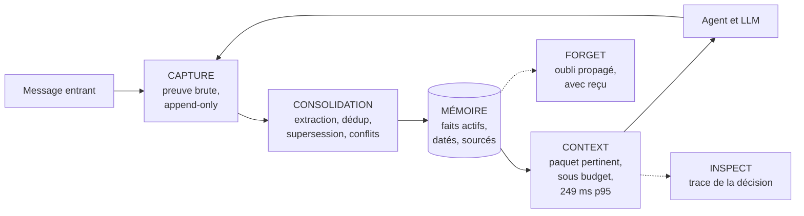

<div align="center">

# Haki

### La mémoire fiable pour agents IA
*Reliable context, with proof.*


**Haki donne à n'importe quel agent IA une mémoire qui dure des mois —**
**qui sait distinguer le vrai du périmé — et qui peut prouver chaque souvenir.**

[Démarrage rapide](#démarrage-rapide) ·
[Agent codé](#1-agent-codé--sdk-et-cli) ·
[Cursor](#2-cursor--serveur-mcp) ·
[n8n](#3-n8n--template-et-nœuds) ·
[Gateway](#4-gateway-compatible-openai) ·
[API](#api-en-un-coup-dœil) ·
[Recherche](research/)

</div>

---

## Ce que fait Haki

Un agent IA, aujourd'hui, ne se souvient de rien au-delà d'une conversation :
chaque nouvelle session repart de zéro, réexplique le contexte, et peut
appliquer une préférence périmée depuis des mois sans aucun moyen de le
savoir.

Haki est une couche de mémoire persistante, indépendante du modèle et du
framework utilisés : elle extrait des faits structurés des échanges d'un
agent, les garde à jour dans le temps, et fournit à chaque nouvelle requête
un paquet de contexte pertinent, daté et sourcé. Le tout reste sous votre
contrôle — un `docker compose up` suffit pour l'installer, et l'agent, le
modèle et l'infrastructure existants ne changent pas.

---

## Le problème

Les équipes qui construisent des agents IA en production rencontrent
systématiquement les mêmes limites :

| Symptôme | Conséquence |
|---|---|
| L'utilisateur doit répéter une information déjà donnée | Expérience dégradée, abandon |
| L'agent applique une préférence remplacée depuis longtemps | Réponse incorrecte, confiance rompue |
| Tout l'historique est réinjecté dans le prompt à chaque appel | Coût et latence élevés, dilution du contexte utile |
| Impossible d'expliquer pourquoi une information a été utilisée | Aucune traçabilité, aucun débogage possible |
| Les données d'un client peuvent fuiter vers un autre | Incident de sécurité |

Les approches existantes (bases vectorielles génériques, résumés de
conversation) fonctionnent en démonstration, mais se dégradent après
quelques semaines d'usage réel : informations périmées servies comme
actuelles, contradictions non détectées, aucune explicabilité.

---

## L'approche

**Un registre de faits, pas un historique de conversation.** Haki n'archive
pas les messages bruts pour les relire plus tard : il en extrait des faits
structurés — préférences, contraintes, décisions — chacun relié à
l'événement source qui le justifie.

**Bitemporalité et supersession.** Chaque fait porte une date de validité et
un statut explicite. Quand une information change, l'ancien fait est marqué
*remplacé* — jamais supprimé silencieusement, jamais resservi comme actuel.
En cas de contradiction non résolue, les deux versions sont masquées et
signalées plutôt que servies au hasard.

**Traçabilité systématique.** Chaque paquet de contexte injecté est
accompagné de ses sources, de ses dates de validité et d'une trace
expliquant quelles mémoires ont été retenues, écartées ou bloquées, et
pourquoi. La question « pourquoi l'agent a-t-il utilisé cette information ? »
a une réponse vérifiable en moins d'une minute.

---

## Démarrage rapide

> Prérequis : Docker et [uv](https://docs.astral.sh/uv/). Les valeurs par
> défaut de `.env.example` suffisent pour démarrer, aucune clé n'est
> requise. Pour une configuration personnalisée (clé LLM réelle, etc.),
> copiez ce fichier en `.env`.

```bash
# Infrastructure (PostgreSQL 16 + pgvector, Redis 7)
docker compose up -d

# Dépendances (uv installe Python 3.12 si nécessaire)
uv sync

# Base de données
uv run alembic upgrade head

# API
uv run uvicorn app.main:app --port 8100
```

> En cas de problème, `bash scripts/doctor.sh` diagnostique Docker, les
> conteneurs, Postgres, `.env`, les migrations et l'API en une seule
> commande — lecture seule, sans effet de bord, à relancer autant que
> nécessaire.

Dans un second terminal, la vérification que tout fonctionne :

```bash
uv run haki connect --api-url http://localhost:8100
uv run haki verify
```

`haki verify` exécute un scénario complet en quelques secondes : une
préférence, puis un changement d'avis dans la **même** conversation, puis
une **nouvelle** conversation qui interroge la mémoire. Elle doit servir la
valeur courante, garder l'ancienne au statut `superseded` plutôt que de
l'effacer, et rattacher le tout à une trace.

```
haki verify — subject usr_verify_91d952a5e06f

  ✔ capture     "Je préfère recevoir mes factures en français."    thr_35bb7ecf
  ✔ consolidate 1 fact(s) extracted                                0.2s
  ✔ capture     "En fait, envoie-les moi en anglais plutôt, pa..." thr_35bb7ecf (same thread)
  ✔ consolidate 1 supersession                                     0.1s
  ✔ context     NEW thread thr_3a21ef34                            0.0s

    recalled  invoice_language = {"language": "en"}   valid since 2026-08-11
    hidden    invoice_language = {"language": "fr"}   superseded
    trace     7c99a8de-4905-43b4-94df-21fb66492b3b

OK — your agent remembered across conversations, and it can prove it.  0.5s
```

La commande sort en 1 si la valeur périmée est encore servie, **ou** si
l'ancienne valeur n'est pas retrouvée comme remplacée : servir la bonne
valeur par accident, sans lien entre les deux faits, n'est pas une mémoire
qui se met à jour.

> Multilingue par défaut : les embeddings locaux sont multilingues
> (français, anglais, espagnol et une cinquantaine d'autres langues) — un
> souvenir capturé dans une langue est retrouvé par une requête dans une
> autre. Vérifié en conditions réelles (`scripts/check_multilingual.py`).

---

## Quatre façons d'utiliser Haki

### 1. Agent codé — SDK et CLI

*Développeurs Python ou TypeScript. Quelques lignes autour de l'appel LLM
existant.*

```python
from haki import HakiClient
from haki.runtime import build_prompt_context, capture_turn

client = HakiClient("http://localhost:8100")

# Avant l'appel LLM : la mémoire devient un bloc d'instructions
packet = client.context(subject_id="usr_42", query=user_msg, project_id="prj")
prompt = build_prompt_context(packet) + "\n" + system_prompt

answer = my_llm(prompt, user_msg)   # le LLM et le code applicatif ne changent pas

# Après l'appel LLM : le tour de conversation repart en mémoire
capture_turn(client, "usr_42", "prj", user_msg, answer)
```

<details>
<summary><b>Détails du SDK</b> (méthodes, async, erreurs)</summary>

- `capture(events, idempotency_key)` — ingestion idempotente : un retry
  réseau ne crée jamais de doublon ;
- `context(subject_id, query, project_id, budget_tokens=2000)` — le
  ContextPacket, avec `trace_id` ;
- `inspect(trace_id)` — pourquoi ces mémoires ont été choisies ;
- `timeline(subject_id, project_id)`, `consolidate_subject(...)`,
  `facts(...)`, `consolidate()`, `forget(...)`, `health()` ;
- Variante asynchrone : `AsyncHakiClient` ;
- Erreurs typées : `HakiApiError` (`error_type`, `field`, `status_code`),
  `HakiConnectionError`.

CLI : `haki login` (connexion par device code, voir ci-dessous), `haki
connect` (configure et teste avec une clé en main), `haki verify` (test
mémoire chronométré), `haki status` (santé de l'API), `haki mcp`
(packaging Cursor).

**`haki login`** — pour un compte Cloud, la clé `hk_` n'est affichée
qu'une fois, au provisionnement : le terminal n'a aucun moyen de la
retrouver. Le flow device code (RFC 8628) comble ce trou sans nouveau
secret. Le CLI affiche un code `XXXX-XXXX` et ouvre
`<HAKI_CONSOLE_BASE_URL>/cli-auth` avec le code déjà pré-rempli
(`verification_uri_complete`) ; le code reste affiché pour être tapé à la
main depuis un téléphone. Vous validez dans la console, déjà connecté —
**le terminal reçoit alors une clé neuve et dédiée**, pas celle de la
console : révoquer ce terminal depuis *Clés* ne déconnecte rien d'autre.
La clé n'est servie qu'une seule fois par le poll qui la consomme.

Côté serveur, `HAKI_CONSOLE_SERVICE_KEY` doit être configurée (c'est elle
qui authentifie la console auprès de `/v1/cli/device/approve`). Les codes
incorrects sont plafonnés **par personne** et non par adresse IP : toutes
les validations arrivent depuis la même adresse (le backend de la
console), donc un compteur par IP serait un seau partagé qu'un seul
utilisateur pourrait vider pour tout le monde.
</details>

#### SDK TypeScript (parité avec le SDK Python)

*Mêmes méthodes, mêmes erreurs typées, même bloc `<haki_memory>` — aucune
dépendance runtime (fetch natif Node 18+).*

```bash
cd sdk/typescript && npm install && npm run build && npm test
```

```typescript
import { HakiClient, buildPromptContext, captureTurn } from "gethaki";

const client = new HakiClient({ baseUrl: "http://localhost:8100", apiKey: "hk_..." });

const { packet } = await client.context({ subjectId: "usr_42", query: userMsg, projectId: "prj" });
const prompt = buildPromptContext(packet) + "\n" + systemPrompt;
const answer = await myLlm(prompt, userMsg);
await captureTurn(client, { subjectId: "usr_42", projectId: "prj", userMsg, assistantMsg: answer });
```

CLI `haki-ts` (`node dist/cli.js …`) : `connect`, `verify`, `status` — même
fichier `~/.haki/config.json` que le CLI Python, les deux sont
interchangeables. Exemple exécutable :
[`sdk/typescript/examples/basic-agent.mjs`](sdk/typescript/examples/basic-agent.mjs).

### 2. Cursor — serveur MCP

*Utilisateurs de Cursor. Installation en un clic, aucune clé à copier
manuellement.*

```bash
uv run haki mcp   # affiche le deeplink, le mcp.json et la Project Rule
```

1. Le deeplink « Add Haki to Cursor » installe le serveur MCP ;
2. La Project Rule (`.cursor/rules/haki.mdc`) indique à l'agent quand
   mémoriser et quand se souvenir ;
3. Cursor retient ensuite les décisions, conventions et erreurs résolues
   entre les sessions.

Quatre outils apparaissent dans Cursor :

| Outil | Rôle |
|---|---|
| `haki_context` | Rappeler le contexte utile du projet avant de coder |
| `haki_capture` | Mémoriser une décision, une convention, une erreur résolue |
| `haki_inspect` | Voir pourquoi une mémoire a été utilisée |
| `haki_forget` | Oublier une information |

> Limite connue et documentée : MCP ne permet pas d'intercepter l'intégralité
> des conversations Cursor — le serveur ne voit que les appels d'outils que
> Cursor décide de déclencher. La Project Rule instruit l'agent sur le
> *quand* ; la couverture réelle est mesurée, jamais présentée comme totale.

### 3. n8n — template et nœuds

*Builders no-code. Un template à importer, trois éléments à configurer.*

Chaîne : `Webhook → Haki Context → AI Agent → Haki Capture → Respond`

Deux options dans [`integrations/n8n/`](integrations/n8n/README.md) :

- Template natif `haki-persistent-support-agent.json` — importable dans
  n'importe quel n8n, sans installation supplémentaire (nœuds HTTP
  standards) ;
- Package de nœuds `n8n-nodes-haki` — nœuds visuels `Haki Context` et
  `Haki Capture`, avec validation intégrée.

Trois configurations suffisent : la credential Haki, la credential LLM, et
l'identité de l'interlocuteur (`subject`). Un appel sans identité stable est
refusé — une mémoire sans identité stable n'est pas fiable.

> Vérifié dans un n8n réel (Docker) : une préférence exprimée au premier
> message est rappelée au second, avec sa source.

### 4. Gateway compatible OpenAI

*Applications déjà compatibles avec l'API OpenAI. Seul `base_url` change —
la mémoire devient automatique.*

```python
import openai

client = openai.OpenAI(
    base_url="http://localhost:8100/gateway/v1",
    api_key="hk_...",                                 # clé Haki
    default_headers={"X-Haki-Subject-Id": "usr_42"},  # identité mémorisée
)
client.chat.completions.create(model="...", messages=[...])
```

À chaque appel `POST /gateway/v1/chat/completions` : la mémoire du sujet est
injectée en tête du system message (bloc `<haki_memory>…</haki_memory>`),
l'appel est transmis au provider configuré (`HAKI_LLM_*` — la clé Haki
n'est jamais envoyée en amont), puis l'échange est capturé (`conversation.turn`,
idempotent) et la consolidation reprend en arrière-plan. La réponse retournée
est celle du provider, inchangée, accompagnée de trois en-têtes :
`X-Haki-Memory`, `X-Haki-Trace-Id`, `X-Haki-Context-Ms`.

- Identité transmise par en-têtes, jamais par le corps de la requête (le
  modèle ne choisit jamais ce qui est mémorisé) : `X-Haki-Subject-Id`
  (requis pour la mémoire), `X-Haki-Thread-Id`, `X-Haki-Run-Id`,
  `X-Haki-Purpose`, `X-Haki-Idempotency-Key` (par défaut : hash du corps —
  un retry ne crée pas de doublon).
- Dégradation contrôlée : sans identité, la requête est transmise sans
  modification (`X-Haki-Memory: disabled`) ; si le contexte ne peut pas être
  construit, la requête part quand même avec le statut `degraded`. L'agent
  n'est jamais bloqué par Haki.
- Streaming : `stream: true` est transmis tel quel (`X-Haki-Memory: disabled`,
  ni injection ni capture) — choix assumé : injecter sans pouvoir capturer
  la réponse finale casserait la boucle mémoire, et bufferiser l'intégralité
  du flux supprimerait l'intérêt du streaming.
- Limite documentée (voir `research/Haki_Memory_Runtime.md`) : le gateway
  observe les appels au modèle, pas les outils exécutés localement par
  l'agent entre deux appels — ceux-ci se capturent via le SDK ou l'API.

Variante httpx dans le SDK : `haki.gateway.gateway_client(base_url, api_key,
subject_id, ...)` (et `async_gateway_client`). Le surcoût mémoire mesuré est
dominé par `build_context` (environ 15 ms en local, p95 de `/v1/context`
sous 250 ms) — benchmark reproductible :
`uv run python scripts/benchmark_gateway.py --api-key hk_...`.

---

## Console web

*Consultation et preuve de la mémoire. Landing page et application console
branchées sur l'API réelle.*

```bash
cd console
npm install
npm run dev        # ou : npm run build && npm start
```

La console tourne sur `http://localhost:3000` et attend l'API sur
`http://localhost:8100` (configurable via `NEXT_PUBLIC_HAKI_API_URL`). Le
navigateur n'appelle jamais l'API directement : un proxy Next
(`/api/haki/*`) relaie les requêtes — l'API n'expose aucune couche CORS, et
la clé `hk_...` reste dans le navigateur (localStorage), jamais sur le
serveur de la console.

- **Landing** — démonstration scriptée du cycle capture → supersession →
  trace, présentation des trois parcours d'intégration, métriques mesurées.
- **Overview** — compteurs du projet et du sujet (faits actifs, événements,
  conflits ouverts, traces).
- **Mémoires** — tous les faits d'un sujet, tous statuts (actif, remplacé,
  contesté, candidat), avec sources, dates, versions ; oubli avec
  confirmation.
- **Timeline** — les événements bruts d'un sujet, avec leurs payloads.
- **Traces** — chaque contexte servi : paquet, décisions
  (`included`/`excluded`/`blocked`) et codes de raison.
- **Conflits** — les contradictions côte à côte, résolution en un clic.
- **Clés** — liste masquée, création (affichage unique), révocation.

Connexion : une clé de projet (`hk_...`) et le `project_id` (l'organisation
n'est nécessaire que pour créer des clés). Données de démonstration
reproductibles (un fait actif, un remplacé, un conflit ouvert, une trace) :
`HAKI_KEY=hk_... bash scripts/seed_console_demo.sh` avec
`HAKI_LLM_PROVIDER=fake`.

---

## Fonctionnement



1. **CAPTURE** — L'application envoie un événement (message, action,
   résultat d'outil). Haki l'enregistre comme preuve immuable et répond en
   quelques millisecondes. Un retry réseau ne crée aucun doublon
   (idempotence).
2. **CONSOLIDATION** — En arrière-plan, Haki lit les événements et détermine
   ce qui doit devenir un fait durable. Il déduplique, détecte les
   changements (l'ancien fait devient *remplacé*) et les contradictions
   (statut *conflit*, masqué jusqu'à résolution). Un fait est identifié par
   **(sujet, prédicat, qualifieurs)** : « heure de lever en semaine » et
   « le week-end » sont deux faits distincts qui coexistent, pas une
   contradiction — et un qualifieur différent n'est jamais rapproché d'un
   autre, aussi proches que soient les formulations.
3. **CONTEXT** — Avant chaque réponse, l'agent demande la mémoire
   pertinente. Haki ne renvoie que les faits actifs, valides et dans le bon
   périmètre, triés par pertinence, dans un budget de tokens strict —
   p95 mesuré à 249 ms sur 10 000 faits (voir scripts/benchmark_context.py).
4. **INSPECT** — À tout moment, la trace explique pourquoi une information a
   été retenue, écartée ou bloquée.
5. **FORGET** — Une correction ou un effacement se propage à tout ce qui en
   dérive, avec un reçu horodaté.

---

## Concepts

| Concept | Définition |
|---|---|
| **Sujet** (`subject`) | La personne ou l'entité dont on se souvient. Une identité stable est obligatoire — pas de mémoire sans identité. |
| **Événement** | La preuve brute : « ce message a été échangé à cette date ». Immuable. |
| **Fait** | Une information considérée vraie à un instant donné. Daté, versionné, sourcé. |
| **Supersession** | Un fait en remplace un autre. L'ancien reste dans l'historique mais n'est plus jamais servi comme actuel. |
| **Conflit** | Deux faits se contredisent sans arbitrage automatique possible : les deux sont masqués et signalés. |
| **ContextPacket** | Le paquet de mémoire injecté avant une réponse : les faits pertinents, dans le budget, avec leurs sources. |
| **Trace** | Le journal expliquant chaque choix de mémoire : retenu, écarté, bloqué, et pourquoi. |
| **Scope** | Le périmètre étanche d'une mémoire (organisation → projet → sujet). Rien ne le traverse. |

---

## Positionnement

| | Approches classiques | Haki |
|---|---|---|
| Changement d'avis | L'ancien et le nouveau fait coexistent, source de contradictions | L'ancien fait est remplacé ; seul l'actuel est servi |
| Contradiction | Servie au hasard au modèle | Masquée, signalée, résoluble explicitement |
| Explicabilité | Boîte noire | Trace et sources pour chaque fait |
| Oubli | Suppression d'une ligne | Propagation en cascade, avec reçu |
| Latence de recherche | Appel réseau d'embedding à chaque requête | Embeddings locaux : aucun appel réseau dans le chemin critique |
| Couverture linguistique | Souvent optimisée pour l'anglais seul | Multilingue natif (environ 50 langues) |
| Déploiement | Plusieurs services à assembler (base vectorielle, file, etc.) | Un seul `docker compose up` |

---

## Performance mesurée

Benchmark reproductible : `uv run python scripts/benchmark_context.py`
(100 requêtes par taille, embeddings locaux, machine de développement
Windows).

| Faits en mémoire | p50 | p95 | Objectif PRD |
|---|---:|---:|---|
| 100 | 60,5 ms | 80,6 ms | < 250 ms |
| 1 000 | 63,7 ms | 68,0 ms | < 250 ms |
| 10 000 | 27,8 ms | 42,5 ms | < 250 ms |

Les embeddings sont calculés localement (ONNX sur CPU, modèle multilingue
384 dimensions) — aucun appel réseau dans le chemin critique. Le retrieval
combine un index vectoriel (hnsw) et un index plein-texte (GIN), puis ne
score que les meilleurs candidats. Le coût LLM (extraction) est entièrement
asynchrone et ne ralentit jamais une réponse.

---

## Benchmarks publics

Haki publie un harnais de benchmark reproductible : configuration figée et
versionnée (dataset et somme de contrôle, modèles, prompts, budgets, prix),
baseline full-context ré-exécutée dans le même protocole (même modèle,
même prompt, même juge), et des métriques rarement publiées par le
secteur — fuite de contradiction, taux d'abstention, tokens par paquet,
latence, coût.

- Harnais : [`eval/`](eval/) (chargeurs LoCoMo et LongMemEval_S, pipeline,
  juge, rapports).
- Résultats : [`eval/results/`](eval/results/) (JSON complet par question,
  résumé Markdown, configuration et somme de contrôle citées).
- Reproduction : commandes exactes dans [`eval/README.md`](eval/README.md).

---

## API en un coup d'œil

| Endpoint | Rôle |
|---|---|
| `POST /v1/capture` | Envoyer des événements (idempotent, accusé de réception immédiat) |
| `POST /v1/context` | Recevoir le ContextPacket (faits, avertissements, `trace_id`) |
| `GET /v1/inspect/{trace_id}` | La trace complète d'une décision de mémoire |
| `GET /v1/timeline` | Les événements d'un sujet (preuve brute) |
| `GET /v1/facts` | Les faits d'un sujet, tous statuts (sources, dates, versions) |
| `GET /v1/traces` | Les traces récentes d'un projet (50 dernières) |
| `GET /v1/conflicts` | Les contradictions en attente de résolution |
| `POST /v1/conflicts/{id}/resolve` | Trancher un conflit |
| `POST /v1/feedback` | Évaluer une mémoire (`useful`/`irrelevant`/`incorrect`) |
| `POST /v1/keys` · `GET` · `DELETE` | Gérer les clés API |
| `POST /v1/consolidate` | Déclencher la consolidation (développement/exploitation) |
| `POST /v1/forget` | Oublier un fait ou un sujet, avec reçu |
| `POST /gateway/v1/chat/completions` | Proxy compatible OpenAI : mémoire injectée et capture automatiques |
| `GET /health` | Santé de l'API |
| `/mcp` | Serveur MCP (Cursor et autres clients MCP) |

> Les exemples curl ci-dessous supposent une clé existante : créez-la avec
> `curl -X POST http://localhost:8100/v1/keys -d '{"org_id":"org_acme","project_id":"prj_support","label":"dev"}'`
> (la première clé est libre, ensuite chaque clé gère son propre projet),
> puis ajoutez `-H "Authorization: Bearer hk_..."` à chaque appel.

Les erreurs sont typées et actionnables :
`{"error": {"type": "missing_scope", "message": "...", "field": "..."}}`
— jamais un message générique.

<details>
<summary><b>Exemple complet : capture puis context</b></summary>

```bash
# Capturer une préférence
curl -X POST http://localhost:8100/v1/capture \
  -H "Content-Type: application/json" \
  -d '{
    "idempotency_key": "demo-1",
    "events": [{
      "org_id": "org_acme", "project_id": "prj_support",
      "subject_type": "user", "subject_id": "usr_42",
      "kind": "conversation.message",
      "occurred_at": "2026-07-15T10:00:00Z",
      "payload": {"role": "user", "content": "Je préfère mes factures en français."},
      "classification": ["customer-data"]
    }]
  }'

# Consolider (extraction du fait durable)
curl -X POST http://localhost:8100/v1/consolidate

# Demander la mémoire avant une réponse
curl -X POST http://localhost:8100/v1/context \
  -H "Content-Type: application/json" \
  -d '{
    "project_id": "prj_support", "subject_id": "usr_42",
    "query": "dans quelle langue envoyer la facture ?",
    "budget_tokens": 2000
  }'
```

Réponse : le fait `invoice_language: {"language": "fr"}`, sa date de
validité, l'identifiant de l'événement source, et un `trace_id`.
</details>

---

## Sécurité, périmètres et oubli

- **Clés API par projet** : chaque appel `/v1/*` exige
  `Authorization: Bearer hk_...` par défaut. Une clé est liée à un seul
  projet : demander un autre projet renvoie `403 forbidden_scope`, sans
  jamais révéler l'existence d'autres projets. Gestion :
  `POST/GET/DELETE /v1/keys` (détails dans
  [`docs/SECURITY.md`](docs/SECURITY.md)).
- **Row-Level Security PostgreSQL** : l'isolation est garantie par la base
  elle-même (RLS sur événements, faits, traces, conflits) — même en cas
  d'oubli d'un filtre applicatif, une requête ne peut pas traverser les
  projets (prouvé par un test de non-divulgation).
- **Policy Engine déterministe** : chaque lecture et écriture passe par des
  règles explicites (scope présent, correspondance clé/projet, audit) —
  jamais par le modèle de langage.
- **Le modèle ne choisit jamais les scopes** : `project_id` et `subject_id`
  proviennent du backend ou de la configuration de l'appelant, jamais du
  LLM.
- **Feedback et correction** : `POST /v1/feedback`
  (`useful`/`irrelevant`/`incorrect` — un fait signalé incorrect devient
  `disputed` et n'est plus servi) ; `POST /v1/conflicts/{id}/resolve`
  tranche une contradiction avec historique complet.
- **Secrets** : la clé LLM vit dans `.env` (ignoré par git, modèle fourni
  dans [`.env.example`](.env.example)), jamais dans le code, le terminal ou
  le frontend.
- **Oubli réel** : `POST /v1/forget` propage l'effacement aux faits,
  embeddings, événements et traces, avec un reçu horodaté dans
  `forget_receipts`.
- Un mode de développement ouvert existe (`HAKI_AUTH_REQUIRED=false`) pour
  un usage local uniquement, avec avertissement explicite au démarrage.

---

## Architecture

<details>
<summary><b>Stack et modules (pour les techniciens)</b></summary>

**Stack** : FastAPI · SQLAlchemy 2.0 async · PostgreSQL 16 + pgvector (hnsw)
· Alembic · Redis 7 · fastembed (ONNX CPU) · SDK MCP officiel · Next.js
(console web).

**Modules** :

- **Memory Ledger** (`app/ledger/`) — événements append-only bitemporaux
  (`occurred_at` = temps métier, `recorded_at` = temps système), faits
  versionnés, transitions de statut explicites :
  `candidate → active → superseded/disputed/disabled → deleted` (terminal).
- **Memory Consolidator** (`app/consolidator/`) — extraction LLM validée
  par Pydantic (aucun crash de batch possible), déduplication par contenu
  (rejeu idempotent), supersession, ensembles de conflit. Un échec du
  provider marque le job `failed` sans toucher aux événements, qui restent
  rejouables.
- **Context Assembler** (`app/context/`) — filtres stricts (actif, scope,
  validité) puis score hybride :
  `0.6 × similarité cosinus + 0.25 × plein-texte + 0.15 × récence`.
  Retrieval en deux phases (sélection sur index, puis scoring) pour un coût
  stable quelle que soit la taille de la mémoire.
- **Providers interchangeables** (`app/providers/`) — extracteur
  (`HAKI_LLM_PROVIDER=fake|openai`) et embedder
  (`HAKI_EMBED_PROVIDER=local|fake`, local par défaut) configurés
  indépendamment. Aucun SDK fournisseur en dur.
- **Serveur MCP** (`app/mcp_server/`) — monté dans l'API, transport
  Streamable HTTP.
- **Gateway** (`app/gateway/`) — proxy compatible OpenAI : injection du bloc
  `<haki_memory>` (rendu par `build_prompt_context` du SDK, implémentation
  unique), transmission en amont via `HAKI_LLM_*` (jamais la clé Haki),
  capture idempotente après réponse, streaming en pass-through documenté.

**Base de données** (migrations Alembic) : `events`, `facts` (embedding
`vector(384)`, `search_vector` tsvector + GIN), `jobs`, `conflict_sets`,
`context_traces`, `forget_receipts`, `organizations`, `credit_transactions`.
</details>

---

## Qualité et tests

74 tests Python et 7 tests Node contre une base PostgreSQL réelle (aucun
mock de base de données) : `uv run pytest` et
`cd sdk/typescript && npm test`.

Les tests vérifient des garanties de comportement, pas des détails
d'implémentation :

- un fait remplacé n'est jamais retourné comme actif ;
- un sujet ne voit jamais la mémoire d'un autre sujet ;
- un retry réseau ne crée jamais de doublon ;
- un conflit ouvert masque les deux faits concernés ;
- après un oubli, plus rien n'est servi ;
- les transitions de statut illégales sont refusées ;
- le gateway injecte la mémoire, dégrade sans jamais bloquer, propage les
  erreurs amont et capture une seule fois par clé d'idempotence.

Vérifications de bout en bout déjà exécutées en conditions réelles :
extraction LLM (OpenRouter), serveur MCP (client officiel), workflow n8n
(Docker), benchmark de latence.

Le détail des garanties tenues aujourd'hui, chacune citant le mécanisme et
le test qui la prouve, est documenté dans
[`docs-site/fr/production-guarantees.mdx`](docs-site/fr/production-guarantees.mdx).

---

## Feuille de route

| Étape | Statut |
|---|---|
| Memory Ledger et capture idempotente | fait |
| Consolidator (supersession, conflits) et ContextPacket | fait |
| Embeddings locaux et benchmark p95 sous 250 ms | fait |
| SDK Python et CLI `haki` | fait |
| Serveur MCP et intégration Cursor | fait |
| Intégration n8n (template et nœuds) | fait |
| Sécurité : clés API, RLS, Policy Engine, feedback | fait |
| Gateway compatible OpenAI (mémoire automatique par `base_url`) | fait |
| Console web (timeline, traces, correction) | fait |
| SDK TypeScript | fait |
| Benchmarks publics LoCoMo et LongMemEval (harnais reproductible) | fait |
| Authentification Clerk et facturation Cloud (crédits) | fait |
| Authentification CLI par device code (`haki login`) | fait |
| Résolution d'identité multi-canal | à venir |
| Observabilité de la santé mémoire (tableau de bord) | à venir |

---

## Structure du dépôt

```
haki/
├── app/                    # API FastAPI (ledger, consolidator, context, gateway, MCP)
├── console/                # Console web Next.js (landing + app branchée sur l'API)
├── sdk/python/             # SDK + CLI haki
├── sdk/typescript/         # SDK TypeScript + CLI haki-ts (parité Python)
├── integrations/n8n/       # Template + nœuds communautaires
├── alembic/                # Migrations PostgreSQL
├── tests/                  # Tests de comportement (dont harnais eval)
├── eval/                   # Harnais de benchmark public (LoCoMo + LongMemEval)
├── scripts/                # Benchmarks et vérifications
├── research/               # PRD, stratégie, décisions produit
└── docker-compose.yml      # Postgres + pgvector + Redis
```

## Documentation

Le dossier [`research/`](research/) contient les documents de décision
internes : le [PRD V1](research/PRD_Haki_V1.md) (faisant autorité), le
[document maître](research/Haki_V1_Document_Maitre.md) (analyse
concurrentielle et stratégie), les
[flows d'onboarding](research/Haki_MVP_Onboarding.md) et la
[spécification du Memory Runtime](research/Haki_Memory_Runtime.md).

La documentation produit (guides, référence API complète, contrat de
production) est dans [`docs-site/`](docs-site/) — site Mintlify, se lance en
local avec `mint dev` depuis ce dossier (Node 18/20/22 LTS requis).

---

<div align="center">

**Haki — votre agent se souvient de ce qui compte, et peut le prouver.**

</div>
