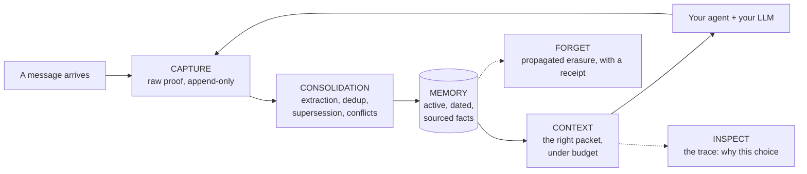

<Note>
  Project status: **private beta**. This documentation is generated from
  the real `haki` repository code (FastAPI routes, Pydantic schemas, SDKs)
  — every request/response example comes from a cited source file, never
  a guess.
</Note>

## Haki, in one sentence

Picture a brilliant colleague with amnesia: every new conversation starts
from zero. That is what an AI agent lives through today. **Haki is that
agent's infallible notebook**: it writes down what matters, retrieves the
right information at the right time, crosses out what is no longer true
without ever erasing it, and can show the exact proof behind every memory
it uses.

That notebook belongs to **your** agent, whatever its model (OpenAI,
Anthropic, a local model…) and whatever its body (Python code, an n8n
workflow, Cursor…). You keep your stack; Haki adds the memory.

## Three ideas

<CardGroup cols={3}>
  <Card title="Facts, not a transcript" icon="database">
    Haki does not archive your conversations: it extracts **structured
    facts** from them (preferences, constraints, decisions), linked to
    their **proof** — the exact source event that produced them.
  </Card>
  <Card title="Today's truth" icon="clock-rotate-left">
    Every fact has a validity date and a status. When the user changes
    their mind, the old fact is **superseded** — never silently deleted,
    never served as current.
  </Card>
  <Card title="Proof on every answer" icon="magnifying-glass">
    Every injected memory packet ships with its sources, its dates, and a
    **trace** explaining what was kept, discarded, or blocked — and why.
  </Card>
</CardGroup>

## How it works

1. **[Capture](/en/api-reference/capture)** — your application sends an
   event (a message, an action, a tool result); Haki records it as
   immutable proof and answers in milliseconds, with no duplicate on
   retry.
2. **[Consolidation](/en/concepts/consolidator)** — in the background,
   Haki extracts what deserves to become a durable fact, deduplicates,
   detects changes of mind (supersession) and contradictions (conflict).
3. **[Context](/en/concepts/context-assembler)** — before every answer,
   your agent asks for memory; Haki only returns facts that are active,
   valid, in the right scope, ranked by relevance, under a strict token
   budget.
4. **[Inspect](/en/api-reference/context)** — at any time, the trace
   shows every memory that was kept, discarded or blocked, with the exact
   reason.
5. **[Forget](/en/concepts/forget)** — correction or erasure: forgetting
   propagates to everything derived from it, with a timestamped receipt.

## Four ways to use Haki

<CardGroup cols={2}>
  <Card title="Coded agent — SDK + CLI" icon="code" href="/en/sdk/python">
    Three lines around your LLM call, in Python or TypeScript.
    `client.context(...)` before the call, `capture_turn(...)` after.
  </Card>
  <Card title="Cursor — MCP server + Hooks" icon="terminal" href="/en/integrations/cursor">
    One-click install (`haki mcp`) or guaranteed capture via Cursor Hooks
    (`haki hooks`). Four tools, one Project Rule.
  </Card>
  <Card title="OpenAI-compatible gateway" icon="arrows-turn-right" href="/en/api-reference/gateway">
    Change `base_url`, keep your code: memory is injected and captured
    automatically on every `chat.completions` call.
  </Card>
  <Card title="Web console" icon="window">
    Landing page + app wired to the real API: memories, timeline, traces,
    conflicts, keys. Not covered by this site — see `console/README` in
    the repository.
  </Card>
</CardGroup>

## Performance (measured, not promised)

Reproducible benchmark: `uv run python scripts/benchmark_context.py`
(100 requests per size, local embeddings, Windows dev machine).

| Facts in memory | p50 | p95 | PRD target |
|---|---:|---:|---|
| 100 | 60.5 ms | 80.6 ms | < 250 ms |
| 1,000 | 63.7 ms | 68.0 ms | < 250 ms |
| 10,000 | 27.8 ms | **42.5 ms** | < 250 ms |

This 42 ms figure (p95, 10,000 facts) is the only performance measurement
cited in this documentation outside of its exact context — do not
generalize it to a different token budget, a different data volume, or a
different machine. It holds because embeddings are computed **locally**
(ONNX CPU, 384-dimension multilingual model): no network call sits in the
critical path of `/v1/context`.

## Where to start

<CardGroup cols={2}>
  <Card title="2-minute quickstart" icon="rocket" href="/en/quickstart">
    Docker Compose, migrations, first API key, first
    capture → context.
  </Card>
  <Card title="API reference" icon="book" href="/en/api-reference/introduction">
    Every `/v1/*` endpoint, exact request/response schemas, typed error
    codes.
  </Card>
</CardGroup>
