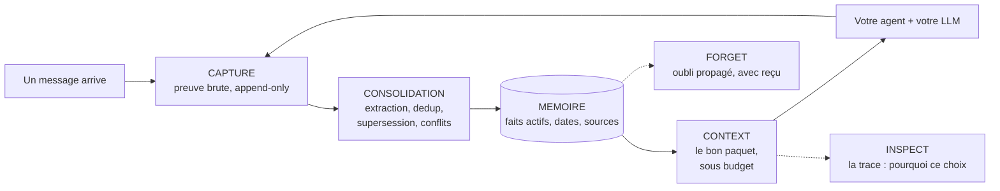

<Note>
  Statut du projet : **bêta privée**. Cette documentation est générée à
  partir du code réel du dépôt `haki` (routes FastAPI, schémas Pydantic,
  SDK) — chaque exemple de requête/réponse provient d'un fichier source
  cité, jamais d'une supposition.
</Note>

## Haki, en une phrase

Imaginez un collègue brillant, atteint d'amnésie : chaque nouvelle
conversation repart de zéro. C'est ce que vit un agent IA aujourd'hui.
**Haki est le cahier de notes infaillible de cet agent** : il note ce qui
compte, retrouve la bonne information au bon moment, barre ce qui n'est
plus vrai sans jamais l'effacer, et peut montrer la preuve exacte derrière
chaque souvenir utilisé.

Ce cahier appartient à **votre** agent, quel que soit son modèle (OpenAI,
Anthropic, un modèle local…) et quel que soit son corps (code Python,
workflow n8n, Cursor…). Vous gardez votre stack ; Haki ajoute la mémoire.

## Trois idées

<CardGroup cols={3}>
  <Card title="Des faits, pas un historique" icon="database">
    Haki n'archive pas vos conversations : il en extrait des **faits
    structurés** (préférences, contraintes, décisions), reliés à leur
    **preuve** — l'événement source exact qui les a produits.
  </Card>
  <Card title="La vérité d'aujourd'hui" icon="clock-rotate-left">
    Chaque fait a une date de validité et un statut. Quand l'utilisateur
    change d'avis, l'ancien fait est **remplacé** (superseded) — jamais
    supprimé en silence, jamais servi comme actuel.
  </Card>
  <Card title="La preuve à chaque réponse" icon="magnifying-glass">
    Chaque paquet de mémoire injecté est accompagné de ses sources, de ses
    dates et d'une **trace** expliquant ce qui a été retenu, écarté ou
    bloqué — et pourquoi.
  </Card>
</CardGroup>

## Comment ça marche

1. **[Capture](/fr/api-reference/capture)** — votre application envoie un événement (message, action, résultat
   d'outil) ; Haki l'enregistre comme preuve immuable et répond en
   millisecondes, sans doublon en cas de retry.
2. **[Consolidation](/fr/concepts/consolidator)** — en arrière-plan, Haki extrait ce qui mérite de devenir un
   fait durable, déduplique, détecte les changements d'avis (supersession)
   et les contradictions (conflit).
3. **[Context](/fr/concepts/context-assembler)** — avant chaque réponse, votre agent demande la mémoire ; Haki ne
   renvoie que les faits actifs, valides, dans le bon périmètre, triés par
   pertinence, sous un budget de tokens strict.
4. **[Inspect](/fr/api-reference/context)** — à tout moment, la trace montre chaque mémoire retenue, écartée
   ou bloquée, avec la raison exacte.
5. **[Forget](/fr/concepts/forget)** — correction ou effacement : l'oubli se propage à tout ce qui en
   dérive, avec un reçu horodaté.

## Quatre façons d'utiliser Haki

<CardGroup cols={2}>
  <Card title="Agent codé — SDK + CLI" icon="code" href="/fr/sdk/python">
    Trois lignes autour de votre appel LLM, en Python ou TypeScript.
    `client.context(...)` avant l'appel, `capture_turn(...)` après.
  </Card>
  <Card title="Cursor — serveur MCP + Hooks" icon="terminal" href="/fr/integrations/cursor">
    Installation en un clic (`haki mcp`) ou capture garantie via Cursor
    Hooks (`haki hooks`). Quatre outils, une Project Rule.
  </Card>
  <Card title="Gateway compatible OpenAI" icon="arrows-turn-right" href="/fr/api-reference/gateway">
    Changez `base_url`, gardez votre code : la mémoire s'injecte et se
    capture automatiquement à chaque appel `chat.completions`.
  </Card>
  <Card title="Console web" icon="window">
    Landing + app branchée sur l'API réelle : mémoires, timeline, traces,
    conflits, clés. Non couverte par ce site — voir `console/README`
    dans le dépôt.
  </Card>
</CardGroup>

## Performance (mesurée, pas promesse)

Benchmark reproductible : `uv run python scripts/benchmark_context.py`
(100 requêtes par taille, embeddings locaux, machine de dev Windows).

| Faits en mémoire | p50 | p95 | Objectif PRD |
|---|---:|---:|---|
| 100 | 60,5 ms | 80,6 ms | < 250 ms |
| 1 000 | 63,7 ms | 68,0 ms | < 250 ms |
| 10 000 | 27,8 ms | **42,5 ms** | < 250 ms |

Ce chiffre de 42 ms (p95, 10 000 faits) est la seule mesure de performance
citée dans cette documentation en dehors de son contexte exact — ne le
généralisez pas à un autre budget de tokens, une autre volumétrie ou une
autre machine. Il tient parce que les embeddings sont calculés
**localement** (ONNX CPU, modèle multilingue 384 dimensions) : aucun appel
réseau dans le chemin critique de `/v1/context`.

## Par où commencer

<CardGroup cols={2}>
  <Card title="Démarrage en 2 minutes" icon="rocket" href="/fr/quickstart">
    Docker Compose, migrations, première clé API, premier
    capture → context.
  </Card>
  <Card title="Référence API" icon="book" href="/fr/api-reference/introduction">
    Tous les endpoints `/v1/*`, schémas de requête/réponse exacts, codes
    d'erreur typés.
  </Card>
</CardGroup>
